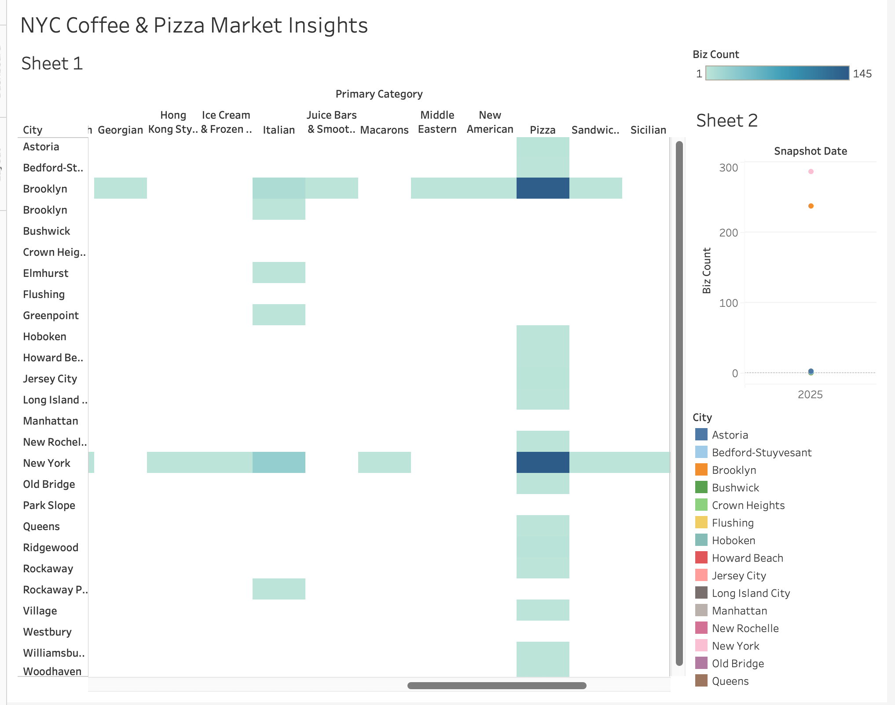

# Yelp Market Insights – End-to-End BI Pipeline & Dashboard

This project analyzes the NYC restaurant market by building a complete **Business Intelligence pipeline** using **Python, PostgreSQL, and Tableau**.  
Data was sourced from the **Yelp Fusion API**, transformed and modeled in PostgreSQL (raw → staging → analytics schemas), and visualized in Tableau to uncover insights on **market saturation, customer ratings, and pricing tiers** for optimal site selection.

---

## ⚙️ Tech Stack
**Languages & Tools:** Python, PostgreSQL, SQL, Tableau Public, Pandas, psycopg2  
**Concepts:** ETL/ELT, API Integration, Data Modeling, Data Visualization, Business Intelligence  

---

##  Architecture

Yelp Fusion API → Python ETL Script → PostgreSQL (raw / staging / analytics) → Tableau Dashboard

- **Raw Layer:** Direct ingestion using Python via Yelp Fusion API  
- **Staging Layer:** Cleaned and standardized data (price tiers, categories, snapshot dates)  
- **Analytics Layer:** Aggregated metrics (average rating, median reviews, business counts)

---

##  Key Insights
- Ingested and analyzed **700+ NYC coffee and pizza businesses**  
- Revealed borough-level differences in **market density, customer ratings, and pricing**  
- Identified **high-opportunity areas** for new business openings with low competition and strong demand  

---

## Dashboard Preview

> 


### Dashboard Features
- Dynamic filters for **City** and **Category (Coffee & Pizza)**  
- Interactive **heatmaps** and **trend charts** for business counts and ratings  
- Quick view of **average rating, median reviews, and price tiers**

---

##  Repository Structure

yelp_bi_project/
│
├── load_to_postgres.py # Python ETL loader script
├── sql/
│ ├── create_raw_schema.sql
│ ├── create_staging_schema.sql
│ └── create_analytics_schema.sql
├── yelp_businesses_raw.csv # Example data sample (subset)
└── README.md # Project documentation

---

##  How to Run Locally

1. **Clone the repository**
   ```bash
   git clone https://github.com/<your-username>/yelp_bi_project.git
   cd yelp_bi_project
Install dependencies
pip install psycopg2 pandas python-dotenv
Set up PostgreSQL
Create a new database: yelp_bi
Run the SQL files in /sql to create schemas
Load the data
python3 load_to_postgres.py
Connect Tableau
Open Tableau → Connect → PostgreSQL
Host: localhost, Port: 5432, Database: yelp_bi, User: your Mac username
Use tables in the analytics schema (e.g., business_daily) for visuals

Future Improvements
Automate daily or weekly API pulls for time-series trend tracking
Add predictive modeling for popularity or rating forecasting
Expand to additional categories or cities
Containerize the pipeline with Docker for portability and deployment
